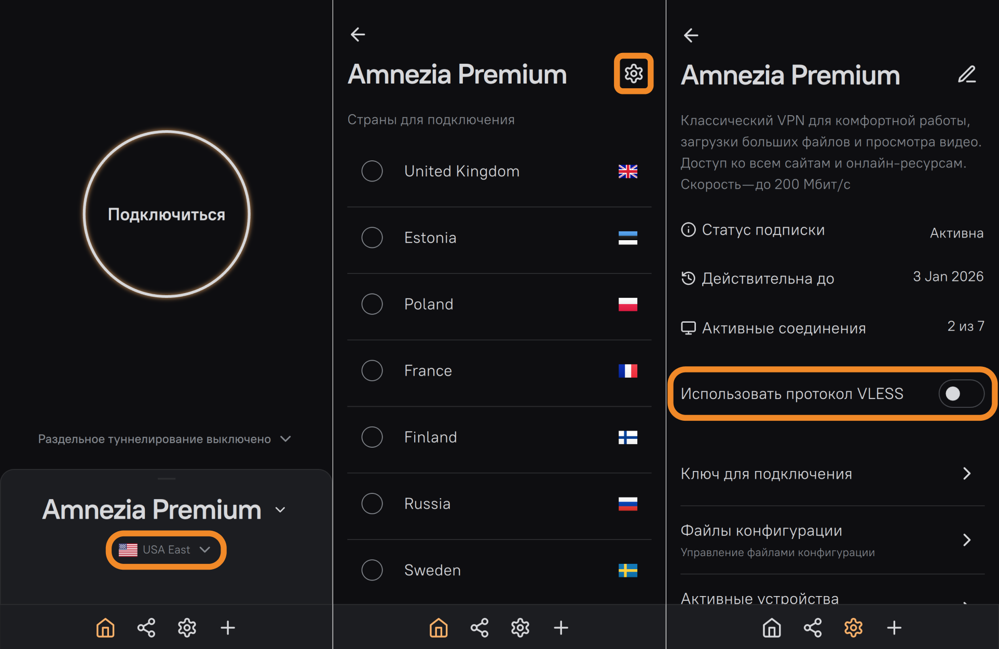
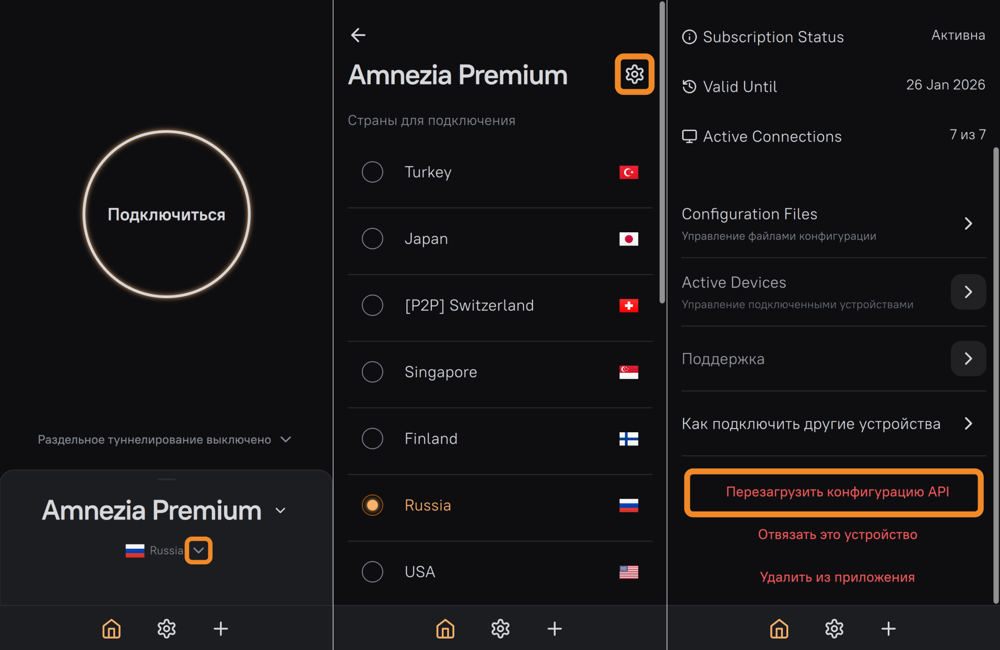

Если проблема продолжит воспроизводиться, напишите нам в [TG-
чат](https://t.me/amnezia_free_support_bot) или на почту
[support@amnezia.org](mailto:support@amnezia.org).

* * *

## Amnezia Premium[​](amnezia-on-ios-in-russia.html#amnezia-premium "Прямая
ссылка на Amnezia Premium")

Если у вас ещё нет подписки **Amnezia Premium** , подробную информацию о ней
вы можете найти на нашем сайте:

  * <https://pay.amnezia.org/ru>
  * <https://storage.googleapis.com/amnezia/pay?m-path=/ru> (зеркало)

После покупки Premium-подписки вы получите письмо с ключом подключения на
почту, указанную при оплате.

Если вы не получили письмо или потеряли ключ для подключения, напишите нам в
[TG-чат](https://t.me/amnezia_premium_support_bot) или на почту
[support@amnezia.org](mailto:support@amnezia.org).

* * *

### Подключение через ключ в приложениях AmneziaVPN и DefaultVPN[​](amnezia-
on-ios-in-russia.html#подключение-через-ключ-в-приложениях-amneziavpn-и-
defaultvpn "Прямая ссылка на Подключение через ключ в приложениях AmneziaVPN и
DefaultVPN")

  1. Откройте письмо с деталями заказа, которое вы получили после оплаты Premium-подписки и скопируйте из него ключ **vpn://**.
  2. Откройте приложение **AmneziaVPN** или **DefaultVPN** и нажмите на иконку ➕ (**плюс**) или на кнопку **Приступим** в приложении **AmneziaVPN** , если у вас не было других подключений.
  3. Нажмите кнопку **Вставить** возле поля для ввода ключа → **Продолжить** /**Добавить** → **Подключиться**.

Создалось новое подключение **Amnezia Premium** — можно подключаться.

Если происходит какая-то ошибка, проверьте, что вы полностью скопировали ключ.

* * *

### Протоколы подключения[​](amnezia-on-ios-in-russia.html#протоколы-
подключения "Прямая ссылка на Протоколы подключения")

По умолчанию VPN-соединение будет устанавливаться по нашему обновлённому
протоколу **AmneziaWG 1.5**. В большинстве случаев этого будет достаточно для
обхода блокировок. Чтобы быть на шаг впереди блокировок, мы также добавили
поддержку протокола **XRay VLESS Reality**.

Ознакомиться подробнее с принципом работы новых протоколов:

  * [XRay VLESS Reality](../xray.html)
  * [AmneziaWG 1.5](new-amneziawg-selfhosted.html#%D0%BE%D0%B1%D1%89%D0%B0%D1%8F-%D0%B8%D0%BD%D1%84%D0%BE%D1%80%D0%BC%D0%B0%D1%86%D0%B8%D1%8F)

* * *

#### Как подключаться к VPN через VLESS-протокол в приложении
DefaultVPN[​](amnezia-on-ios-in-russia.html#как-подключаться-к-vpn-через-
vless-протокол-в-приложении-defaultvpn "Прямая ссылка на Как подключаться к
VPN через VLESS-протокол в приложении DefaultVPN")

  1. Отключитесь от VPN.
  2. Нажмите на значок «▾» (**стрелочка** справа от подключения **Amnezia Premium**).
  3. На следующем экране нажмите на иконку 📝 (**карандаш**) справа от **Amnezia Premium**.
  4. Включите VLESS-протокол, переключив ползунок **Use VLESS protocol**.
  5. Вернитесь на главный экран и нажмите кнопку **Подключиться**.

* * *

#### Как подключаться к VPN через VLESS-протокол в приложении
AmneziaVPN[​](amnezia-on-ios-in-russia.html#как-подключаться-к-vpn-через-
vless-протокол-в-приложении-amneziavpn "Прямая ссылка на Как подключаться к
VPN через VLESS-протокол в приложении AmneziaVPN")

  1. Отключитесь от VPN.
  2. Нажмите на название локации.
  3. На следующем экране нажмите на иконку ⚙️ (**шестерёнка**) справа вверху.
  4. Включите VLESS-протокол, переключив ползунок **Использовать протокол VLESS**.
  5. Вернитесь на главный экран и нажмите кнопку **Подключиться**.

* * *

### FAQ при подключении Amnezia Premium[​](amnezia-on-ios-in-russia.html#faq-
при-подключении-amnezia-premium "Прямая ссылка на FAQ при подключении Amnezia
Premium")

VPN не подключается, либо подключается, но нет трафика (не открывается
заблокированный ресурс/приложение)

Прежде всего попробуйте сбросить конфигурации API:

  1. На главном экране приложения **AmneziaVPN** или **DefaultVPN** нажмите на значок «▾» (**стрелочка** справа от подключения **Amnezia Premium** , с которым возникла проблема).
  2. Нажмите на иконку ⚙️ (**шестерёнка**) или 📝 (**карандаш**) справа вверху.
  3. В открывшемся разделе настроек нажмите сначала на кнопку **Перезагрузить конфигурацию API** , затем на кнопку **Продолжить**.

Эта функция сброса не «сломает» ваше подключение, лишь поможет получить
обновлённые параметры VPN-сервера.

Если проблема продолжит воспроизводиться, напишите нам в [TG-
чат](https://t.me/amnezia_premium_support_bot) или на почту
[support@amnezia.org](mailto:support@amnezia.org)

* * *

### Управление подпиской (личный кабинет)[​](amnezia-on-ios-in-
russia.html#управление-подпиской-личный-кабинет "Прямая ссылка на Управление
подпиской \(личный кабинет\)")

В приложении **AmneziaVPN** доступны те же функции управления вашей
подпиской, что и в [личном
кабинете](https://storage.googleapis.com/amnezia/cp):

  * создание и скачивание файлов конфигурации;
  * количество активных подключений и устройств;
  * отключение подключенных устройств;
  * дата окончания подписки.

Рекомендуем ознакомиться с [инструкцией по личному
кабинету](personal_dashboard.html) — в ней много полезной информации и ответов
на часто задаваемые вопросы.

Для управления подпиской:

  1. Откройте приложение **AmneziaVPN** и нажмите на название локации.
  2. Нажмите на иконку ⚙️ (**шестерёнка**) справа вверху.

* * *

## Self-hosted VPN[​](amnezia-on-ios-in-russia.html#self-hosted-vpn "Прямая
ссылка на Self-hosted VPN")

В приложении **AmneziaVPN** вы можете подключиться к VPN через ваш собственный
сервер, на котором установлен протокол **AmneziaWG 1.0**.

Для настройки VPN-подключения через собственный сервер с помощью приложения
**AmneziaVPN** рекомендуем ознакомиться с нашими инструкциями:

  * [Self-hosted это просто](../selfhosted-is-easy.html)
  * [Установка VPN на свой сервер](install-vpn-on-server.html)
  * [Использование протокола AmneziaWG 1.5 на Self-hosted серверах](new-amneziawg-selfhosted.html)

* * *

## Меню настроек приложения AmneziaVPN[​](amnezia-on-ios-in-russia.html#меню-
настроек-приложения-amneziavpn "Прямая ссылка на Меню настроек приложения
AmneziaVPN")

Чтобы зайти в настройки **AmneziaVPN** , нажмите на иконку ⚙️ (**шестерёнка**)
на главном экране приложения.

  1. **Серверы** : используйте для управления добавленными **подключениями** , например, Amnezia Free или Amnezia Premium.
  2. **Соединение** : здесь хранятся настройки **DNS** и **раздельного туннелирования**.
  3. **Приложение** : в этом разделе можно **изменить язык** приложения или включить **логирование** (может понадобиться для диагностики проблем с подключением при обращении в поддержку).
  4. **Резервное копирование** : для создания резервной копии **всех настроек и подключений** или для её восстановления (пригодится, например, для переноса настроек на новое устройство).
  5. **Об AmneziaVPN** : здесь вы найдёте **наши контакты** , информацию о **версии приложения** и **политику конфиденциальности**.

* * *

## Приложение DefaultVPN[​](amnezia-on-ios-in-russia.html#приложение-
defaultvpn "Прямая ссылка на Приложение DefaultVPN")

После удаления **AmneziaVPN** из российского App Store мы создали новое
приложение — **DefaultVPN**.

Установка приложения **DefaultVPN** не потребует от вас дополнительных
действий, достаточно
[скачать](https://apps.apple.com/ru/app/defaultvpn/id6744725017) его в App
Store **любой страны**.

Функционал **DefaultVPN** значительно отличается от AmneziaVPN: в нём нет
раздельного туннелирования, раздела управления подпиской и собственным
сервером.

[Предыдущая страницаЛичный кабинет Amnezia
Premium](personal_dashboard.html)[Следующая страницаУстановка AmneziaVPN на
iOS для жителей России](installing-amneziavpn-on-ios.html)

Обращайтесь в чат за помощью, если что-то не получается

  * [Общая информация](amnezia-on-ios-in-russia.html#общая-информация)
  * [Amnezia Free](amnezia-on-ios-in-russia.html#amnezia-free)
    * [Вариант 1: Создание подключения в приложении AmneziaVPN](amnezia-on-ios-in-russia.html#вариант-1-создание-подключения-в-приложении-amneziavpn)
    * [Вариант 2: Подключение через ключ в приложениях AmneziaVPN и DefaultVPN](amnezia-on-ios-in-russia.html#вариант-2-подключение-через-ключ-в-приложениях-amneziavpn-и-defaultvpn)
    * [FAQ при подключении Amnezia Free](amnezia-on-ios-in-russia.html#faq-при-подключении-amnezia-free)
  * [Amnezia Premium](amnezia-on-ios-in-russia.html#amnezia-premium)
    * [Подключение через ключ в приложениях AmneziaVPN и DefaultVPN](amnezia-on-ios-in-russia.html#подключение-через-ключ-в-приложениях-amneziavpn-и-defaultvpn)
    * [Протоколы подключения](amnezia-on-ios-in-russia.html#протоколы-подключения)
    * [FAQ при подключении Amnezia Premium](amnezia-on-ios-in-russia.html#faq-при-подключении-amnezia-premium)
    * [Управление подпиской (личный кабинет)](amnezia-on-ios-in-russia.html#управление-подпиской-личный-кабинет)
  * [Self-hosted VPN](amnezia-on-ios-in-russia.html#self-hosted-vpn)
  * [Меню настроек приложения AmneziaVPN](amnezia-on-ios-in-russia.html#меню-настроек-приложения-amneziavpn)
  * [Приложение DefaultVPN](amnezia-on-ios-in-russia.html#приложение-defaultvpn)

Продукты

[Amnezia Premium](https://amnezia.org/premium)[Amnezia
Free](https://amnezia.org/free)[Amnezia Self-hosted](https://amnezia.org/self-
hosted)

Ресурсы

[Документация](../../documentation.html)[Решение
проблем](../../troubleshooting.html)[FAQ](../../faq.html)

Контакты

[Github](https://github.com/amnezia-vpn/amnezia-
client)[Telegram](https://t.me/amnezia_vpn)[Reddit](https://reddit.com/r/AmneziaVPN/)

