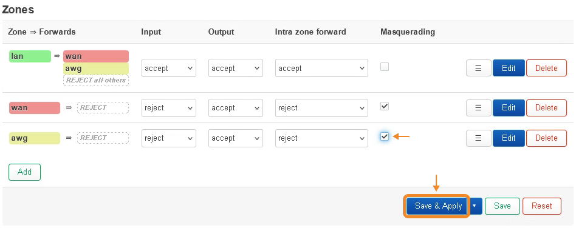
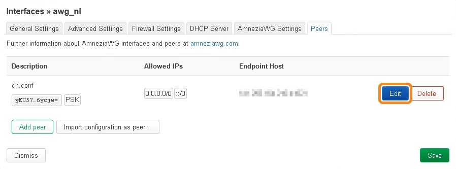
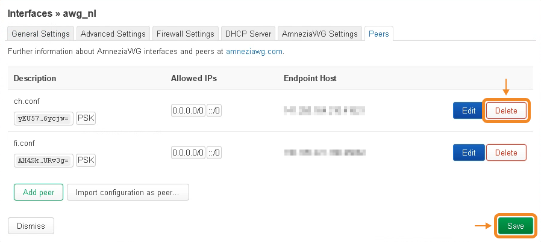

* * *

## Шаг 4. Настройка файрвола роутера[​](openwrt-os-awg.html#шаг-4-настройка-
файрвола-роутера "Прямая ссылка на Шаг 4. Настройка файрвола роутера")

  1. Перейдите в **Network** → **Firewall**.

  2. Нажмите **Edit** справа от зоны **lan**.

  3. Нажмите на выпадающий список **Allow forward to destination zones** → поставьте галочку возле ранее созданной файрвол-зоны → нажмите **Save**.

  4. Поставьте галочку в параметре **Masquerading** возле ранее созданной файрвол-зоны → нажмите **Save & Apply**.

  5. Перейдите в **Network** → **Interfaces**.

  6. Нажмите **Edit** справа от созданного ранее VPN-интерфейса.

  7. Перейдите на вкладку **Peers** → нажмите **Edit** справа от загруженного ранее файла конфигурации.

  8. Поставьте галочку у параметра **Route Allowed IPs** → нажмите **Save** → ещё раз **Save**.

  9. В появившемся окне, находясь на вкладке **Interfaces** , нажмите **Save & Apply** → наведите курсор на **System** → нажмите **Reboot**.

  10. Нажмите **Perform reboot**.

После перезагрузки роутера проверьте наличие трафика — интернет должен начать
работать через VPN.

* * *

## Как поменять параметры VPN-подключения на новые из другого файла
конфигурации[​](openwrt-os-awg.html#как-поменять-параметры-vpn-подключения-на-
новые-из-другого-файла-конфигурации "Прямая ссылка на Как поменять параметры
VPN-подключения на новые из другого файла конфигурации")

  1. Перейдите в **Network** → **Interfaces**.

  2. Нажмите **Edit** справа от созданного VPN-интерфейса.

  3. В появившемся окне нажмите **Load configuration**.

  4. Вставьте всё содержимое файла конфигурации или переместите файл конфигурации в появившееся окно → нажмите **Import settings** → нажмите **OK** , чтобы подтвердить внесение изменений.

  5. На вкладке **Peers** нажмите **Delete** справа от старого файла конфигурации → **Save**.

  6. Нажмите **Edit** справа от загруженного ранее файла конфигурации → поставьте галочку у параметра **Route Allowed IPs** → нажмите **Save** → ещё раз **Save**.

  7. В появившемся окне, находясь на вкладке **Interfaces** , нажмите **Save & Apply**.

[Предыдущая страницаУстановка VPN на роутер Keenetic](keenetic-os-
awg.html)[Следующая страницаПодключение к Amnezia Free](connect-amfree.html)

Обращайтесь в чат за помощью, если что-то не получается

  * [Шаг 1. Установка OpenWrt на роутер](openwrt-os-awg.html#шаг-1-установка-openwrt-на-роутер)
  * [Шаг 2. Установка AmneziaWG на роутер OpenWrt](openwrt-os-awg.html#шаг-2-установка-amneziawg-на-роутер-openwrt)
  * [Шаг 3. Создание VPN-подключения на роутере](openwrt-os-awg.html#шаг-3-создание-vpn-подключения-на-роутере)
  * [Шаг 4. Настройка файрвола роутера](openwrt-os-awg.html#шаг-4-настройка-файрвола-роутера)
  * [Как поменять параметры VPN-подключения на новые из другого файла конфигурации](openwrt-os-awg.html#как-поменять-параметры-vpn-подключения-на-новые-из-другого-файла-конфигурации)

Продукты

[Amnezia Premium](https://amnezia.org/premium)[Amnezia
Free](https://amnezia.org/free)[Amnezia Self-hosted](https://amnezia.org/self-
hosted)

Ресурсы

[Документация](../../documentation.html)[Решение
проблем](../../troubleshooting.html)[FAQ](../../faq.html)

Контакты

[Github](https://github.com/amnezia-vpn/amnezia-
client)[Telegram](https://t.me/amnezia_vpn)[Reddit](https://reddit.com/r/AmneziaVPN/)

