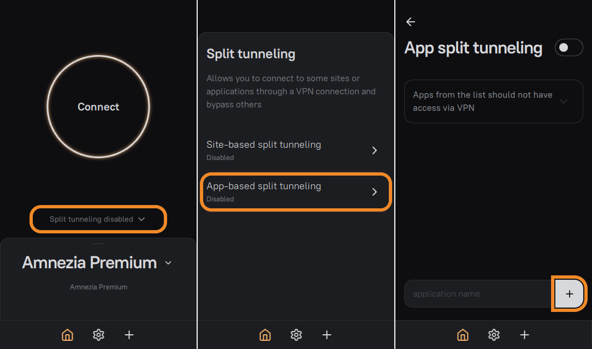
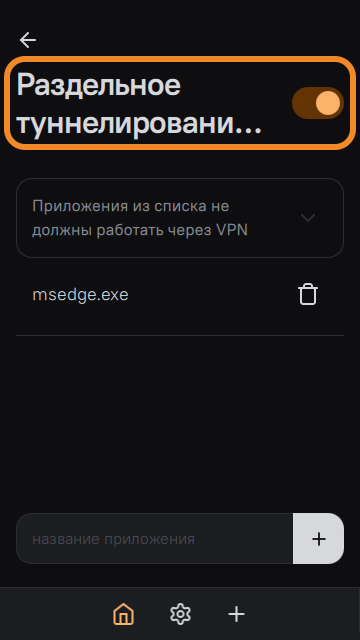
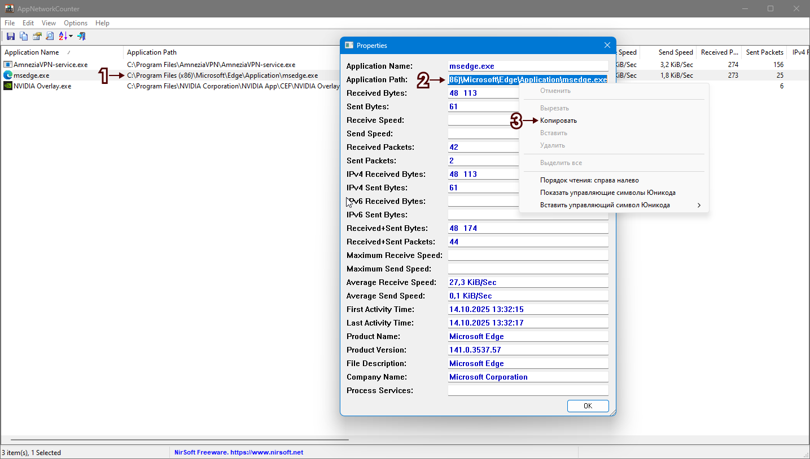
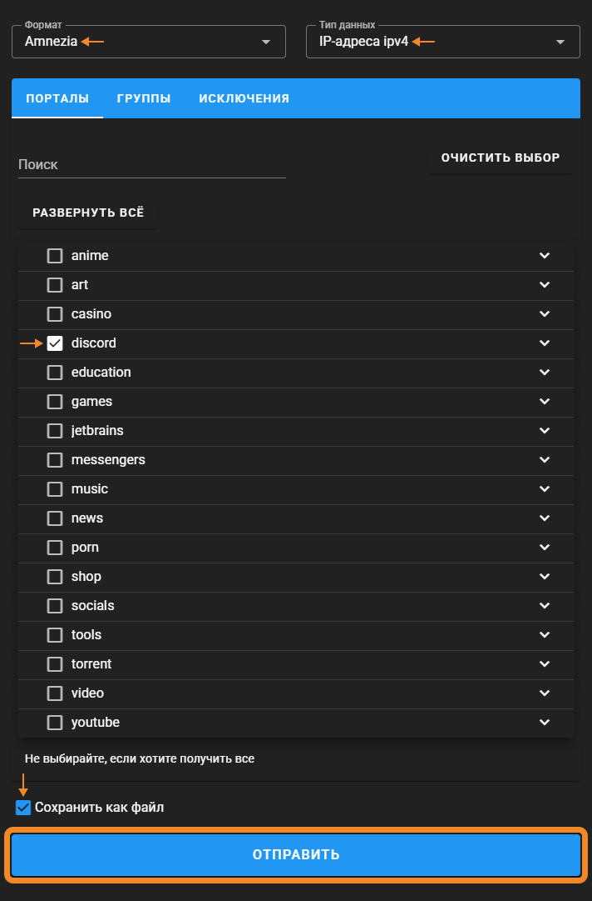
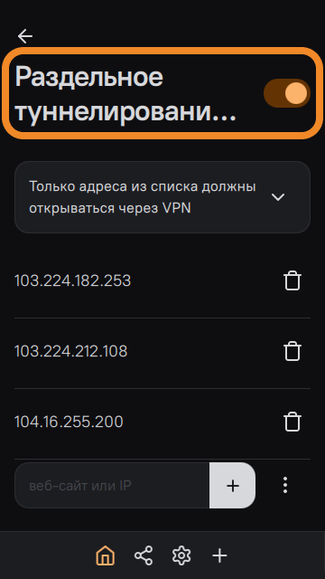

Это наиболее эффективный и рекомендуемый нами способ раздельного
туннелирования на устройствах Windows/iOS/macOS/Linux.

  1. Перейдите на сайт <https://iplist.opencck.org/ru> → выберите формат **Amnezia** и тип данных **IP-зоны IPv4 (CIDR)**.

![](data:image/png;base64,iVBORw0KGgoAAAANSUhEUgAAAooAAABXCAYAAACDS2RUAAAAAXNSR0IArs4c6QAAAARnQU1BAACxjwv8YQUAAAAJcEhZcwAADsMAAA7DAcdvqGQAABDtSURBVHhe7d3ZixxVG8fx91/JRS4CXs1dcqlRFBEXcMEgogRJDEZN3CKKilsMxIgx7ia4xd1ojInRRMEN3EHFfVdUVNz3rV6+Z3iGMyenN6dnpnvm2/BhUntVd87TvzpV3f2/OXPmNJIkSVLJoChJkqQqg6IkSZKqDIqSJEmqMihKkiSpyqAoSZKkKoOiJEmSqgyKkiRJqjIoSpIkqcqgKEmSpCqDoiRJkqoMipIkSaoyKEqSJKnKoChJkqQqg6IkSZKqDIqSJEmqMihKkiSpyqAoSZKkKoOiJEmSqgyKkiRJqjIoSpIkqWpag+IBBxzQ3Hnnnc0pp5xSnS5JM9mtt97a7N69ew/33ntvqo+1ZSRpKk1LUDzmmGOazZs3Nzt37mweffTR9Hfr1q3N2Wef3cybN6+6jCTNVEcffXTz4IMPetIsaeBMeVA88sgjmwceeKC5+OKLm4MOOmisR3Hx4sUpLJ5zzjlpvv3337+56aabUoh85JFHmiuvvLJZsGBBOsu+6667mttuuy1Nw+WXXz4WMDlD37JlS1p3bPO0005L851//vlp+KSTTkrzsN7t27engMp+3XfffWmY8Lpjx47m4YcfHtsfSZostaDIv6mP1Dzq24YNG8Z6GplGTeumF7KcN5+vVgtjmdh2OdzLtJAfX9R6/s1xUedvvvnmcfNLGhxTHhQvueSS1Js4f/78VEwoKhQMpq1evbq5/fbb07Srrroqhb599tmnOfTQQ1OIY1mWodBRNEdGRpoVK1akQEcYZB0ss2vXrrGARyHatGlTKpAExX333TfNc+GFF6bpjGPdESzLfZKkydYpKJ544okpyOVBMQ9k5XCOWnjPPffssVy7Wthu/b1MC+XxcXJPrV++fHnqOCA85vNLGhxTHhQJgODfFBOKShQPChWFcMmSJamwnXHGGWPLESLvuOOOVHDyZQiC9C6uXbs2DVP4mG/jxo1p2nHHHZfOmLdt2zbWo5hjPRQw1stwuU+SNNnaBcVDDjkk9bhxwhshLKZFICuHc1FXa8vlmBa1sN36O02L3kn+Ejy51ag8PsIoNZ66TGiMfZA0eP5TUKQnb9GiRc3KlSub008/va1y2Qh8rXoUCXrHHnvsHkUzD5H5MqB3McInyxMa77777hQS161bl4IkBSuC4llnnZXWTzHjEjPFqpegWDtOSdOPmkRtokbV2u5kmEg9DO2C4nnnnZfq2apVq8YFsvh3Pm8M56h71EBOnMv5WtVC5ovAxxUbpuVhs920WD/bozZTk3l+yuNbs2ZN89BDD6VpMS5Xe/4kda9f9bDnoMgG2YGFCxc2c+fOrc7TTjf3KB544IET6lGkMF533XWpSFFgWSeFjPGHH3546mE888wz0/yshwLWS1CUNJioSdQmatRUhMWJ1sPQKihSt6hX1DCGI4Tl/4558+EctRDlfO1qYbv19zItTvBPOOGEccfH+8D999+faj51mjrOeEn906962HNQJJ2y4dq0btHTxwdSuMG61aeeO92juH79+jQvPYwUoGXLlqXlIihyzyJnvQRFilIExaOOOirNz7Z44giYnNUaFKWZgxrVqqeqn/pRD9EqKFIbqWkLFiwYF8Lyf8e8+XCIqzNxD3c+X7ta2G793U6LHkUumfM8xfHFeC6nU7/pOOAezNhnSf010XrYc1CkK3MiZ845iglFheJRTuvmU89xH0z5qWcCIQGTkJiHS8YzDzdvs97HHnssrYeQunTp0jSt3T5JGg7UKGpVbVo/9asetgqKBLcIUQzXAlk5LZbfb7/90jjqXH6ZmJNzaivztKqF7dbfaVpcluZv7R5FjoftxHHRKcAHHPm3pP6baD3sOSjShVkbP1UoRhQlCk5tuiRhKmrVdNfDdlrVSk6YOaHOx0ma2SZSqwyKkmYkg6JBUdKoWRUUJakbsz0oSlIwKEpSwaAoSaMMipJUMChK0iiDoiQVDIqSNMqgKEkFg6IkjTIoSlLBoChJowyKklQwKKpXe+21V7N79+70Aw216dOF3/t+7bXX0q+a1aZLnQxtUKRRvv76680vv/ySGkJtnkHGb1G/+OKL436TWtJgGJag+MwzzzQ///xzs2LFijTMr1D9+eefTf74999/m++//z790gl1s1zHMOI4+OUZTNYx8Yswn3/++bjnt51du3al55nf1o5xp556avPWW281f//9d3otfv311+bpp59uDjvssLF54jXjV8Ni3DvvvJPmjwfLs574be1y2fzBvJ9++mlz0UUXpXn4lZ0333wz4d/58lI3hjYonnzyyalR8uAnpGrzDLKNGzemBs7f2nRJ02fYgyI/ucc48FN7hIR//vknhZlyHcPo4IMPbj7++OOEf9fmmSieK0J2N0Hxsssua3788cfmxhtvHBtHYPzhhx+ab7/9Nv3EIcOPP/54en3eeOONZu+9907ztQqKX331VXPBBRekbbP8N9980/z222/N+vXrx+arvd7MyzbZdoTW5cuXp3Hbtm0bW1bq1tAGRX6LmQb82WefJfkZmiRNxLAHxTx0gJ6kDz/8MIWNxYsXj5umPRHQCH7vvvtux6AYV7fef//9sfAX4/KwFghrvEbXXHNNGm4VFL/44ovUqxnjuHTMuHx8q9d7zZo1ze+//z6uE4WQ+t1336XQmM8rdTKUQZHGSKPEpk2bUnc+DSafh4bDZeknn3wy/eVBDyQ/aI/ojaQxcTYWly8oCBQGGhiFlTNKuvJfeumlcd32/Jt1szzz0AD5gfqYXl46iAfjmc7+0cDz/b7++utTIY9tfvDBB+nSRUyXNDVmWlCszVuiphEmqKc8qG3UuLzuUY+oS9Qn6tSXX345dokTUT/ZVoxDGXw67Uu74wDrYX1RT2OYe/Hyuv3yyy+PdSJQw8ugzHbopaMXLsZxvKyX9XC5vt1+gtfxp59+SpfBy3FsM58X3CoV700M1461fL4C+8lx3XLLLWm41fNUex1iu3Sy5PNKnUykVk1bUDz33HNTI9i6dWtq9DT+559/ftw8NBwe3Kuxbt26hK78v/76K4VEGhyXZCh6FETOwFguGhjjdu7cmX7b9JVXXkmNM4oJoZL7TCio/B4qZ4zvvfdeKjhcgmCe448/Pq0rEDzZNoUn9i8PildccUVanm2xvquvvjqd0eZnqZKmRr9qVTv92Ea3QTFOrtv1KHKplTpHreLe6SeeeCINU2eZTk8UJ8RcwmQ7q1evTpd+816zqJ/TFRTZX/ab/Xn22WfTMPeCU7NvuOGGVNf5G+shGPN+wK1MMS6uVlHL2X67/QShjQDG8xHjOu1/rjZvq6DI68K24vlttZ1aj+IRRxyR1kmYzueVOhnKoMh/fs7WYn2ExK+//nrcp7poODSo/IMuNOi88CHOsuJsMAodBSTmWbZsWSqQ0TgpCIS6/H6PuGeyLJCgaFFM8/tS2D8aOA2d4c2bN6ezXwJmLMdxdipS0kw3MjLSbNiwIQUZPlVawzTmYd7aOno17EGxvEeRsETti16sUoQITnjLqytR06iJ1Eouy8ZyUfcifJTLhKkKitTQ2H/+ctzxXsH7A+8T0anAvY10JHCJOJaJe/nieWL7nWowx8JJfR42O+1/rjZvq6BYPr+11zvuUeR1KT8sGevl9c7Ha3gMWz2clqDIZQTuSeQ/fDRu7vUguOVnirUGTqNiHH9jXNnwYjhvtFGE+NQZw0z7448/0gdRonGuWrUqFZ0oXIHLGNxIXt4bwjpo4Pm+lGrHIM1G8+bNSzfx14oj45jGPLVl/4thD4r5g8uwhCVOkOfPn5/q5tKlS8dqF3WJ8SzPX4ajR5FgyBsOyxAiqXHlh0cIiRFqWB/7Q0CL9YPLuHnwYb/zB/tIb+fatWvT9DiOvA7noiaXQTHqeKBzgPeGqLOExNgPOgnY1/xKEfvN5fTodOimBufHH+M67X+uNm+vQbF88HzXbltiuXa9yhoOw1QPpyUo0qXOJV9686IIXXrppSmI5WeGtQZOo2JcFA2UDS+G80ZbFqWyyOWPMijGjcv5p+HA+hkf+8J+c1ma46BoxqM8Bmm2qhXHySiKGPag2C6gRD2LR7581L94vPrqq+nkvKyBOfaBKyYEzHL5/JEHH5YhhHJLEMtwlYaAFifUnY6j3J8YjjoeWA/bufbaa9MwnQoMM56rSGyPK0ZM43YfLtfm7y301MV+5ld7crVQ183rEGrz1taJTpeeea0++eST6rIo/79oeA1LPZyWoMh/9FaP/F4TGk7ZIGhUjONvjGM646LhxXDeaMuixBeq0ljzy9o13OMS35sVATawfhp47Atn+9zDuH379rEz9toxSLNZXhwnqyhiJgfFbhHeuKRKL1z0KH700Ud73DNd61GMehrK4FMLLFwRogZyG06n4yhrcgyX2y17FOPyM/93WDa/X49l2z1iW6VajyKvbacPs8T9g7VjLZ+v0M2HWZjG81j74m+O0R7FmWMY6uGUB8Vo5HnPYaDBcDk4PtFVC1nMw7goGigLWwznDa8sSvRqlvcogjPO+IQgy/BlrSyX3zsZWH8eFGuFYceOHXscgzTbRXGcrKKI2RYU4z7sPNiUdW+y71HkWyPo0SPodDqOct9iON9/3iPyexRjPMGXfeZYInC1UnsfKXEs5T2KbJv3KcbHB30C7xu8V0Xtrx1r7f2A9xHG5eNry7brVYz1eo/izDHo9XDKgyKXDWhgcU9JLgpFfEq41sBpVIyLBoqysMVw3vBi3VGUWD8fTKGB8sloLgdw9kZBokeQIkEvItM5O2adgXuDmM76mR77wtkAZ4osRxB94YUX0jDFrLwhWdLkmm1BkZrEZWaW5XJr3KNIDaI2MQ+XhAmT/frUM7Utv/TMuiZ66Zn9JdCyP7H/hEWOL5blfYQet/yycyu195ESYZNj4Rjy8fEhRp4vbj1imH3juHr5wm1eiy1btqT10EFBIIj5Wj1P7BPHnn9w0089678aqqDIf/B2jTvOePn6nFoDp1Exjr8xrixsMZw3vLIogbM2Qh1nwDy4xMz26VGM+WsPxjOd9dPAY19Y7rnnnkvj4vvJnnrqqVTQ8g/pSJp8sy0ooqxp1NKoaTFPP79HMX+wLoJRrKvTcZQ1OYZ5j2j1PYrlst0Eptr7SInXkU6C/HsUAz+59/bbb6d94VF7TmvHynHlDzpI2v2EX/k8Ra9i/m0gccnb71FUr4YqKErSVBiWoKhREf7KgDoV4jLzoH/nLb2L9ErSY1ubLrViUJSkgkFxuExnUETtt54HyZIlS1LvYnlfvdQNg6IkFQyKw2W6gyK4l5MPyZQfXpluXObmu3yRX/KWumVQlKSCQVG94hI032VX+1qa6cS9idyPWfv2DakbBkVJKhgUJWmUQVGSCgZFSRplUJSkgkFRkkYZFCWpYFCUpFEGRUkqGBQlaZRBUZIKBkVJGmVQlKSCQVGSRk1pUFy5cmUzd+7c6jRJGgTUKGpVbVo/WQ8lDbqJ1sOeg+KiRYuahQsXVqdJ0iCgRlGratP6yXooadBNtB72HBRHRkZSFyYb9kxa0iChJlGbqFHUqto8/WQ9lDSo+lUPew6KYIOkU7oy2QFJGgTUJGrTVITEYD2UNIj6VQ//U1CUJEnSzGdQlCRJUpVBUZIkSVUGRUmSJFUZFCVJklRlUJQkSVKVQVGSJElVBkVJkiRVGRQlSZJUZVCUJElSlUFRkiRJVQZFSZIkVRkUJUmSVGVQlCRJUpVBUZIkSVUGRUmSJFUZFCVJklRlUJQkSVKVQVGSJElVBkVJkiRVGRQlSZJUMaf5P0u0IotDVqw+AAAAAElFTkSuQmCC)

  2. Поставьте галочки возле нужных сайтов или разделов с сайтами, которые будут открываться **через** VPN.

  3. Внизу страницы поставьте галочку **Сохранить как файл** и нажмите кнопку **Отправить** — на вашем устройстве сохранится файл **ip-list.json**.

  4. Зайдите в параметры раздельного туннелирования сайтов в AmneziaVPN и выберите вариант **Только адреса из списка должны открываться через VPN**.

  5. Нажмите на значок **⋮** (**три точки**) и выберите предпочтительный способ импорта (**Добавить импортированные сайты к существующим** или **Заменить список с сайтами**).

  6. Найдите на устройстве ранее скачанный файл `ip-list.json` и выберите его для импорта → включите раздельное туннелирование сайтов и подключитесь к VPN.

Широкие IP-подсети для таких крупных сервисов, как YouTube или Discord, могут
захватывать IP-адреса несвязанных сайтов/сервисов. Это означает, например, что
подключение к вашему игровому серверу в онлайн-игре может происходить через
VPN.

Если это станет проблемой, вам нужно выяснить, к каким IP-адресам обращается
приложение, чтобы исключить из списка раздельного туннелирования IP-подсети, в
которые входят эти IP-адреса.

Сделать это можно, например, с помощью встроенной в Windows утилиты **Монитор
ресурсов** или через сторонние приложения, такие как **TCPView**.

* * *

### Режим 2: «Адреса из списка не должны открываться через VPN»[​](vpn-split-
tunneling.html#режим-2-адреса-из-списка-не-должны-открываться-через-vpn
"Прямая ссылка на Режим 2: «Адреса из списка не должны открываться через
VPN»")

Мы рекомендуем использовать этот режим раздельного туннелирования только в том
случае, если вам нужно открывать через VPN **всё** , **кроме**
локальной/провайдерской сети.

Если вы хотите, чтобы такие сайты, как `gosuslugi.ru`, `mos.ru` и другие
подобные, открывались без VPN, мы рекомендуем пойти от обратного и настроить
раздельное туннелирование либо по списку IP-адресов, которые будут открываться
через VPN (все прочие IP-адреса откроются без VPN), либо через список
приложений, которые будут работать без VPN (можно сделать один из браузеров
окном для выхода в интернет без VPN).

  1. Зайдите в параметры раздельного туннелирования сайтов и выберите вариант **Адреса из списка не должны открываться через VPN**.

  2. Последовательно скопируйте и добавьте следующие IP-подсети:

     * `192.168.0.0/16`
     * `172.16.0.0/12`
     * `10.0.0.0/8`
     * `169.254.0.0/16`
     * `100.64.0.0/10`
  3. Включите раздельное туннелирование сайтов и подключитесь к VPN.

Если вы всё же решите настроить раздельное туннелирование через исключения
(без VPN открываются только выбранные адреса), IP-адреса сайта можно получить,
например, через командную строку с помощью команды `nslookup`:

  * `nslookup gosuslugi.ru`
  * `nslookup esia.gosuslugi.ru`
  * `nslookup lk.gosuslugi.ru`
  * `nslookup pos.gosuslugi.ru`

* * *

## Раздельное туннелирование приложений на Windows[​](vpn-split-
tunneling.html#раздельное-туннелирование-приложений-на-windows "Прямая ссылка
на Раздельное туннелирование приложений на Windows")

В AmneziaVPN на **Windows** доступен **один режим раздельного туннелирования
приложений** , при котором только приложения из списка будут работать **без
VPN**. Второй режим, при котором только приложения из списка работают **через
VPN** , доступен в AmneziaVPN на **Android** и **недоступен на Windows**.

### Как включить раздельное туннелирование приложений на Windows[​](vpn-split-
tunneling.html#как-включить-раздельное-туннелирование-приложений-на-windows
"Прямая ссылка на Как включить раздельное туннелирование приложений на
Windows")

  1. Зайдите в параметры раздельного туннелирования приложений и нажмите кнопку ➕ (**плюс**).

  2. Выберите исполняемые файлы (`.exe`) приложений, которые должны работать **без VPN**.

  3. Включите раздельное туннелирование сайтов и подключитесь к VPN.

### Как найти файл приложения для добавления в раздельное
туннелирование[​](vpn-split-tunneling.html#как-найти-файл-приложения-для-
добавления-в-раздельное-туннелирование "Прямая ссылка на Как найти файл
приложения для добавления в раздельное туннелирование")

Мы рекомендуем использовать программу
[AppNetworkCounter](https://www.nirsoft.net/utils/app_network_counter.html):
<https://www.nirsoft.net/utils/appnetworkcounter-x64.zip> (портативная версия,
установка не требуется).

**AppNetworkCounter** отобразит все процессы, которые в настоящий момент
выходят в интернет, а также покажет путь к файлу, который можно добавить в
раздельное туннелирование.

Чтобы скопировать путь к файлу, дважды нажмите на процесс и скопируйте
значение поля **Application Path**.

Если после добавления файла в раздельное туннелирование приложение продолжит
работать через VPN, значит оно задействует дополнительные файлы, которые не
имеют **постоянного** подключения к интернету, из-за чего могут не
отобразиться в **AppNetworkCounter** в момент проверки. В таком случае мы
рекомендуем найти в интернете информацию по запросу `split tunneling
название_приложения` или `раздельное туннелирование название_приложения` —
скорее всего, кто-то до вас уже сталкивался с подобной проблемой, и вам
удастся найти информацию о том, какие ещё файлы нужно добавить в раздельное
туннелирование.

* * *

### Какие приложения чаще всего добавляют в раздельное туннелирование на
Windows[​](vpn-split-tunneling.html#какие-приложения-чаще-всего-добавляют-в-
раздельное-туннелирование-на-windows "Прямая ссылка на Какие приложения чаще
всего добавляют в раздельное туннелирование на Windows")

  1. **Торрент-клиент** — чтобы скачивать и раздавать торренты при подключении к любой локации AmneziaVPN, так как торрент-трафик ограничен на всех локациях, **кроме Швейцарии**.
  2. **Браузер** (дополнительный) — чтобы иметь полноценный выход в интернет, который будет работать через ваше основное интернет-подключение, а не через VPN. Исключение браузера из VPN может быть полезно, если вы не хотите настраивать раздельное туннелирование сайтов, но хотите сохранить возможность в любой момент открыть любой сайт без VPN.
  3. **Игровые онлайн-сервисы** (Steam, Epic Games, Battle.net) — чтобы при скачивании игр получить максимальную скорость, доступную вашим тарифом.
  4. **Альтернативный VPN-клиент** , который используется для доступа к **корпоративным** ресурсам.

При одновременном использовании с AmneziaVPN корректная работа следующих VPN-
клиентов **не гарантируется** :

  * AnyConnect
  * OpenConnect

* * *

### Приложения и игры, для которых не работает раздельное туннелирование по
приложениям[​](vpn-split-tunneling.html#приложения-и-игры-для-которых-не-
работает-раздельное-туннелирование-по-приложениям "Прямая ссылка на Приложения
и игры, для которых не работает раздельное туннелирование по приложениям")

Информация ниже касается именно раздельного туннелирования **приложений**. Это
не означает, что использование раздельного туннелирования по IP-адресам не
поможет настроить приложения на работу через/без VPN — наоборот, этот вариант
туннелирования станет выходом из ситуации.

В обход активного VPN-подключения не получится настроить:

  1. Приложения, установленные из Microsoft Store.
  2. Некоторые игры, использующие [античит](https://www.pcgamingwiki.com/wiki/List_of_games_with_anti-cheat_technology), например, Battlefield 6, Valorant, League of Legends и другие.

Как одновременно играть без VPN и пользоваться Discord:

  1. Перейдите на сайт <https://iplist.opencck.org/ru> → выберите формат **Amnezia** и тип данных **IP-адреса IPv4**.
  2. Поставьте галочку возле раздела **Discord**.
  3. Внизу страницы поставьте галочку **Сохранить как файл** и нажмите кнопку **Отправить**.

  4. Зайдите в параметры раздельного туннелирования сайтов и выберите вариант **Только адреса из списка должны открываться через VPN**.

  5. Нажмите на значок **⋮** и выберите вариант **Заменить список с сайтами**.

  6. Найдите на устройстве ранее скачанный файл **ip-list.json** и выберите его для импорта → включите раздельное туннелирование сайтов.

  7. Полностью отключите раздельное туннелирование **приложений**.

* * *

## Раздельное туннелирование приложений на Android[​](vpn-split-
tunneling.html#раздельное-туннелирование-приложений-на-android "Прямая ссылка
на Раздельное туннелирование приложений на Android")

  1. Перейдите в параметры раздельного туннелирования приложений и выберите нужный режим.
  2. Выберите приложения, которые нужно добавить в раздельное туннелирование и нажмите **Добавить выбранные**.
  3. Включите раздельное туннелирование и подключитесь к VPN.

Некоторые приложения (например, **Gemini**) могут быть недоступны для
добавления в список раздельного туннелирования.

В таком случае мы рекомендуем идти от обратного и включить раздельное
туннелирование для приложений, которые нужно открывать **без VPN** (например,
банковские и государственные приложения). Тогда все **прочие** приложения
будут открываться **через VPN** , в том числе Gemini.

Включенное раздельное туннелирование по приложениям (X, Instagram, YouTube и
другие) не влияет на работу **сайтов** одноимённых приложений, которые
открываются через **браузер**.

Браузер — отдельное приложение, к которому применяются другие установленные
или неустановленные вами правила раздельного туннелирования сайтов/приложений.

* * *

## Часто задаваемые вопросы[​](vpn-split-tunneling.html#часто-задаваемые-
вопросы "Прямая ссылка на Часто задаваемые вопросы")

Почему я не могу подключиться к self-hosted VPN (собственный сервер) после
включения раздельного туннелирования?

Обычно причина в том, что IP-адрес вашего сервера входит в одну из IP-
подсетей, добавленных в раздельное туннелирование сайтов. Найдите и удалите
такую подсеть, после чего попробуйте вновь подключиться к self-hosted VPN.

Почему раздельное туннелирование может не работать, если оно настроено
корректно?

Некорректная работа раздельного туннелирования — известная проблема
**устаревших** версий AmneziaVPN (до 4.8.8.3 включительно).

Рекомендуем установить последнюю версию AmneziaVPN:

  * <https://amnezia.org/ru/downloads>
  * <https://storage.googleapis.com/amnezia/amnezia.org?m-path=/ru/downloads> (зеркало)

Почему приложение на Android, которое должно открываться без VPN, сообщает о
том, что VPN используется?

Приложение может видеть, что в системе включен VPN, но это не означает, что
оно работает через VPN.

Можно ли одновременно включить раздельное туннелирование и сайтов, и
приложений?

Да, но только на Windows и Android.

Когда в AmneziaVPN на Windows появится второй режим раздельного туннелирования
приложений (открывать через VPN только выбранные приложения)?

У нас нет сроков реализации режима раздельного туннелирования приложений, при
котором только приложения из списка будут работать через VPN.

Когда в AmneziaVPN на iOS/macOS/Linux появится раздельное туннелирование по
приложениям?

У нас нет сроков реализации раздельного туннелирования приложений на
iOS/macOS/Linux — это связано с текущими ограничениями операционных систем.

[Предыдущая страницаСмена протокола](change-protocol.html)[Следующая
страницаАвтозапуск приложения](autostart.html)

Обращайтесь в чат за помощью, если что-то не получается

  * [Общая информация](vpn-split-tunneling.html#общая-информация)
  * [Раздельное туннелирование по IP-подсетям и IP-адресам](vpn-split-tunneling.html#раздельное-туннелирование-по-ip-подсетям-и-ip-адресам)
    * [Режим 1: «Только адреса из списка должны открываться через VPN»](vpn-split-tunneling.html#режим-1-только-адреса-из-списка-должны-открываться-через-vpn)
    * [Режим 2: «Адреса из списка не должны открываться через VPN»](vpn-split-tunneling.html#режим-2-адреса-из-списка-не-должны-открываться-через-vpn)
  * [Раздельное туннелирование приложений на Windows](vpn-split-tunneling.html#раздельное-туннелирование-приложений-на-windows)
    * [Как включить раздельное туннелирование приложений на Windows](vpn-split-tunneling.html#как-включить-раздельное-туннелирование-приложений-на-windows)
    * [Как найти файл приложения для добавления в раздельное туннелирование](vpn-split-tunneling.html#как-найти-файл-приложения-для-добавления-в-раздельное-туннелирование)
    * [Какие приложения чаще всего добавляют в раздельное туннелирование на Windows](vpn-split-tunneling.html#какие-приложения-чаще-всего-добавляют-в-раздельное-туннелирование-на-windows)
    * [Приложения и игры, для которых не работает раздельное туннелирование по приложениям](vpn-split-tunneling.html#приложения-и-игры-для-которых-не-работает-раздельное-туннелирование-по-приложениям)
  * [Раздельное туннелирование приложений на Android](vpn-split-tunneling.html#раздельное-туннелирование-приложений-на-android)
  * [Часто задаваемые вопросы](vpn-split-tunneling.html#часто-задаваемые-вопросы)

Продукты

[Amnezia Premium](https://amnezia.org/premium)[Amnezia
Free](https://amnezia.org/free)[Amnezia Self-hosted](https://amnezia.org/self-
hosted)

Ресурсы

[Документация](../../documentation.html)[Решение
проблем](../../troubleshooting.html)[FAQ](../../faq.html)

Контакты

[Github](https://github.com/amnezia-vpn/amnezia-
client)[Telegram](https://t.me/amnezia_vpn)[Reddit](https://reddit.com/r/AmneziaVPN/)

