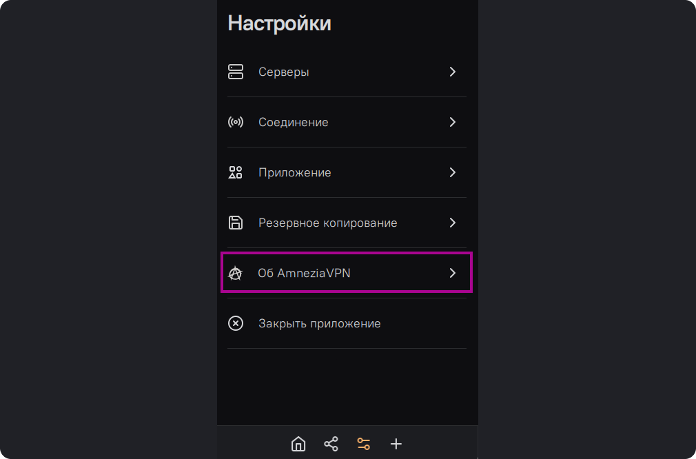
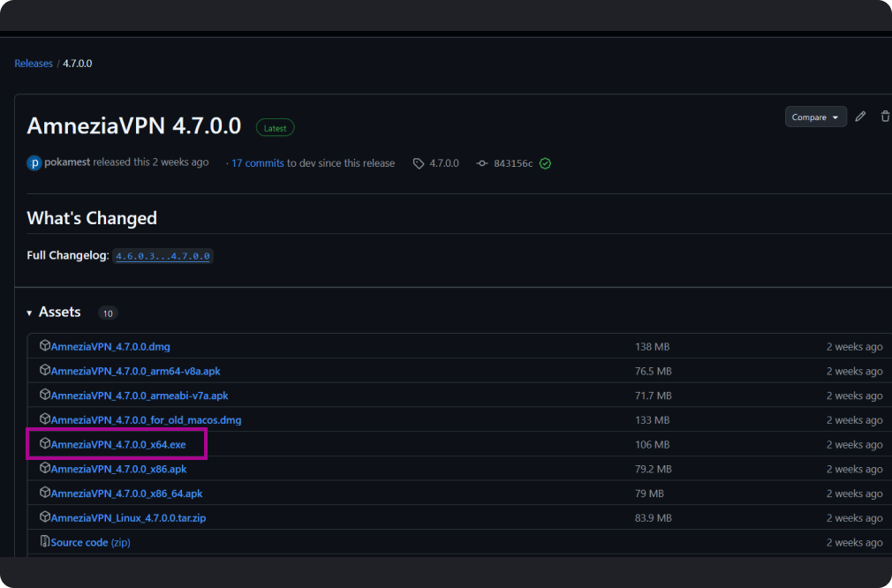

# Обновление приложения на Windows

Для того чтобы обновить приложение на Windows, необходимо сначала скачать
новую версию приложение на устройство. Для этого откройте приложение,
перейдите в настройки, для этого найдите значок настроек на нижней панели.  
Выберите раздел - "Об Амнезия",

Пролистайте страницу вниз , найдите ссылку "Проверить обновления"

 Вы
перейдете на страницу github с последним релизом приложения, найдите файл в
формате .exe (он для Windows) Так же можно скачать последнюю версию приложения
[нашем сайте](https://storage.googleapis.com/kldscp/amnezia.org/ru/downloads)

Откройте трей (нажатием на стрелочку на нижней панели Windows), найдите значок
Amnezia, кликните по нему правой кнопкой мыши, выберите "закрыть AmneziaVPN"

Установите новую версию Amnezia, при необходимости перезагрузите устройство.

