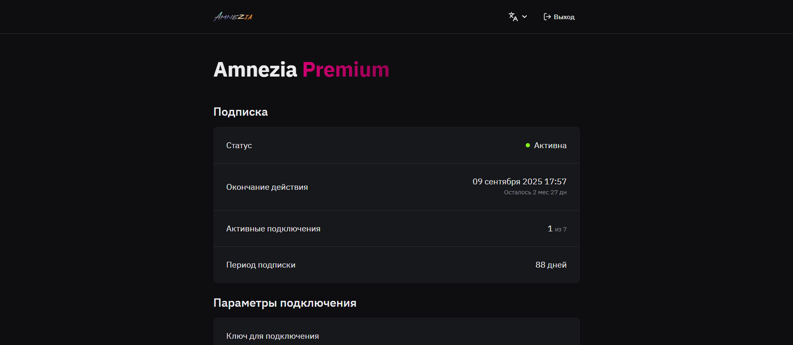
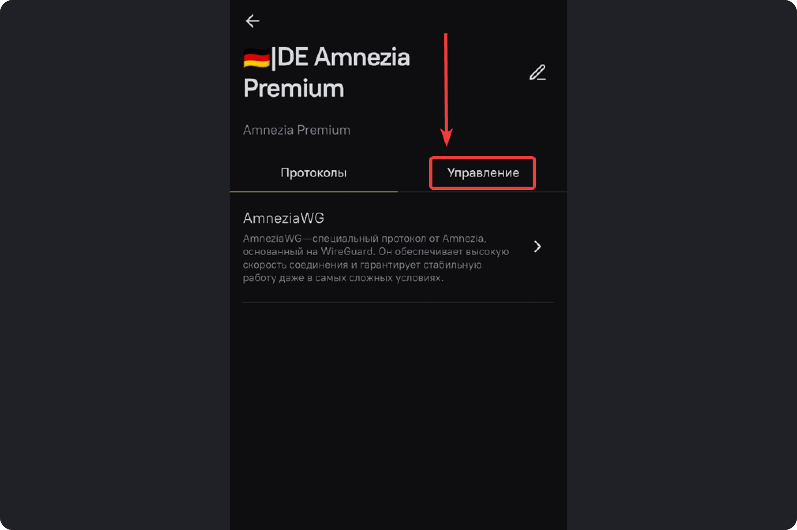
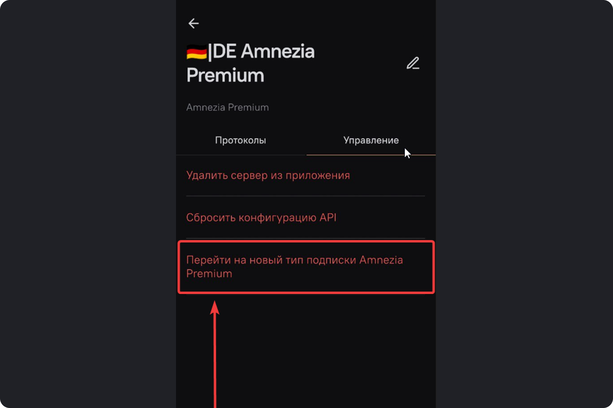
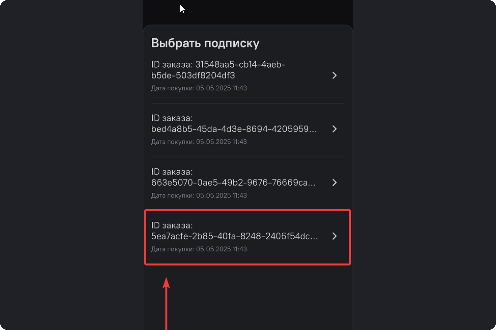
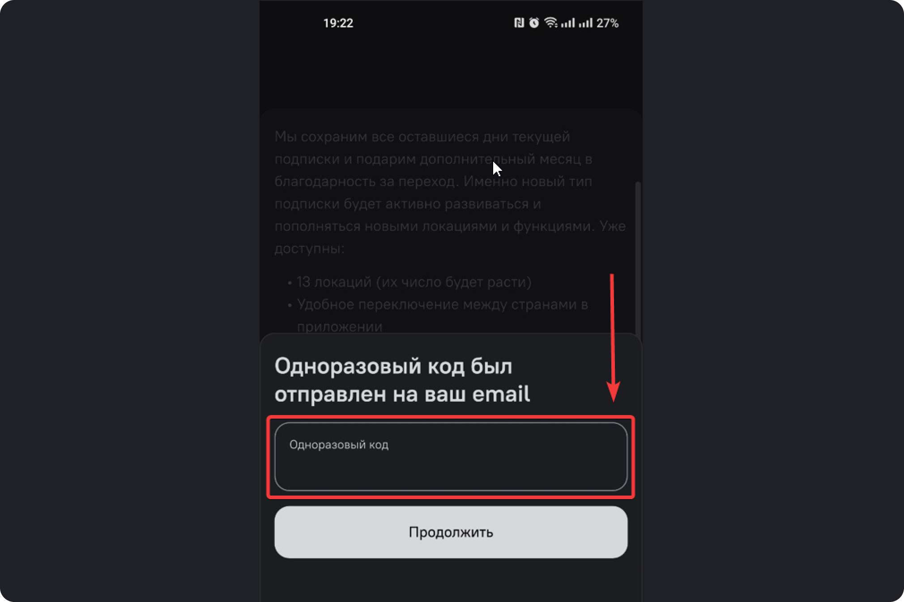

Содержание этой страницы

# Переход на новый тип подписки Amnezia Premium

Мы разработали новый тип подписки, чтобы сделать управление удобнее, а работу
VPN стабильнее и безопаснее. В этой инструкции вы найдёте простые шаги для
быстрого перехода на Amnezia Premium и использования всех её преимуществ. Если
вы покупали подписку Amnezia Premium в формате нескольких ключей

### Основные преимущества новой подписки:

  * **Один универсальный ключ** для подключения до **7 устройств**.
  * **Личный кабинет:**
    * управление подпиской без обращения в поддержку;
    * создание и загрузка конфигураций для приложений AmneziaWG и роутеров (Keenetic, OpenWRT);
    * подробная информация о вашей подписке и всех подключенных устройствах.
  * **Расширенный набор локаций** (уже доступны 20 стран, количество будет постоянно расти).
  * **Повышенная стабильность и защита от блокировок**.

### Доступные локации:

Германия, Нидерланды, США, Швеция, Польша, Великобритания, Сингапур,
Финляндия, Турция, Швейцария (с поддержкой торрент-трафика), Казахстан,
Россия, Франция, Япония, Австралия, Канада, Эстония, Португалия, Южная Корея,
ОАЭ.

* * *

## Как перейти на новую подписку?

### 1\. Проверка текущего статуса подписки

Перейдите в [личный кабинет](https://storage.googleapis.com/amnezia/cp) и
введите ваш текущий ключ.

  * Если вы успешно вошли, у вас уже активна новая подписка. Просто убедитесь, что приложение обновлено до версии **4.8.10.0** или выше. Если часть локаций не отображается, обновите приложение до последней версии.

  * Если появляется ошибка **«К сожалению, у вас старый тип подписки Amnezia Premium»** , значит, вы можете перейти на новую подписку. Следуйте дальнейшим инструкциям.

### 2\. Обновление приложения AmneziaVPN

Убедитесь, что у вас установлена актуальная версия AmneziaVPN (**не ниже
4.8.10.0**). Ссылки на скачивание приложения можно найти на нашем
[сайте](https://storage.googleapis.com/amnezia/amnezia.org).

**Важно:** Если вы используете только устройства на iOS, обратитесь за помощью
в поддержку:

  * Telegram: [Amnezia Premium Support Bot](https://t.me/amnezia_premium_support_bot)
  * Email: [support@amnezia.org](mailto:support@amnezia.org)

### 3\. Процесс миграции на новый тип подписки

В приложении выполните следующие шаги:

  1. Откройте меню **«Настройки сервера»**.

  2. Перейдите в раздел **«Управление»**.

  3. Выберите пункт **«Перейти на новый тип подписки Amnezia Premium»**.

  4. Укажите адрес электронной почты, который использовался при оформлении подписки.

  5. Выберите подходящий для миграции заказ.

  6. Введите одноразовый код из письма и нажмите **«Продолжить»**.

После успешного перехода:

  * Новый ключ для подключения автоматически добавится в приложение.
  * Старые ключи будут автоматически отключены в течение суток. При этом они останутся в списке приложения, удалить их необходимо вручную.
  * Все ранее выданные через поддержку файлы конфигураций также перестанут работать.
  * В качестве бонуса вы получите дополнительно **+1 месяц** подписки бесплатно.

**Важно:** Переход полностью **бесплатный** , дополнительных платежей не
требуется.

* * *

## Тестовый период нового типа подписки

Если вы сомневаетесь, протестируйте новую подписку **бесплатно в течение 3
дней**. Для получения тестового доступа обратитесь в нашу поддержку:

  * Telegram: [Amnezia Premium Support Bot](https://t.me/amnezia_premium_support_bot)
  * Email: [support@amnezia.org](mailto:support@amnezia.org)

Если у вас нет доступа к электронной почте, указанной при оформлении заказа,
или возникают ошибки в процессе миграции — также свяжитесь с нами, и мы
оперативно поможем вам решить проблему.

* * *

## Особенности для различных платформ

### macOS Sequoia[​](migration-instruction.html#macos-sequoia "Прямая ссылка
на macOS Sequoia")

  * Для удаления приложения используйте функцию **«Переместить в корзину»** (Move to Bin) из папки приложений.

### Linux (Ubuntu)[​](migration-instruction.html#linux-ubuntu "Прямая ссылка
на Linux \(Ubuntu\)")

  * Перед использованием установите дополнительные библиотеки: `apt install libxcb-cursor0 libxcb-xinerama0`

## FAQ по миграции на новый тип подписки Amnezia Premium[​](migration-
instruction.html#faq-по-миграции-на-новый-тип-подписки-amnezia-premium "Прямая
ссылка на FAQ по миграции на новый тип подписки Amnezia Premium")

Здесь вы найдёте ответы на распространённые вопросы и важные детали, которые
помогут вам успешно перейти на новый тип подписки.

**Как понять, какой у меня тип подписки?**

  1. **Старый тип** : После покупки вам приходило письмо, где **1 ключ = 1 локация** (например, 5 ключей для 5 локаций).
  2. **Новый тип** : После покупки вам пришло письмо, где указан только **один универсальный ключ** для всех локаций и устройств.

**Можно ли вернуться к старому типу подписки после миграции?**

Нет, после перехода возврат к старой модели невозможен. Если вы сомневаетесь,
рекомендуем сначала воспользоваться **бесплатным тестовым периодом**.

**Как протестировать новый тип подписки перед переходом?**

Вы можете получить **бесплатный тестовый период** на **3 дня** , написав в
нашу поддержку. Тестовая версия является полноценной и включает доступ ко всем
функциям и локациям Amnezia Premium.

**Как узнать, какие устройства подключены сейчас к моему старому ключу?**

На старом типе подписки (один ключ — одна локация) такой возможности нет.
Именно поэтому мы добавили личный кабинет в новом типе подписки, где доступна
вся информация о подключенных устройствах.

**Что делать, если одноразовый код для миграции не приходит на почту?**

  * Убедитесь, что вы вводите корректную электронную почту и проверяйте наличие опечаток.
  * Если проблема сохраняется, обратитесь в поддержку, мы поможем разобраться.

**Можно ли подключать больше 7 устройств одновременно?**

Нет, максимальный лимит сейчас **— 7 устройств одновременно**.

Обратите внимание: при создании файла конфигурации в личном кабинете он
считается за **+1 устройство** в вашем лимите. Нельзя создать много файлов
конфигурации (например, 7 файлов) и дополнительно подключаться по ключу — это
вызовет ошибку подключения.

**Сохраняются ли пользовательские настройки при миграции?**

Да, ваши текущие настройки приложения полностью сохранятся после перехода на
новый тип подписки.

**Что делать, если приложение не обновляется или возникают ошибки при
установке новой версии?**

Обновлённое приложение доступно для всех платформ.

Однако в настоящее время самостоятельная миграция на устройствах iOS временно
недоступна, так как Apple заблокировала обновление приложения в App Store.
Если у вас только устройство на iOS и вам необходимо перейти на новый тип
подписки, пожалуйста, обратитесь в поддержку — мы поможем вам выполнить
миграцию вручную.

**Что произойдёт, если не мигрировать на новый формат подписки?**

  * Без миграции вы не сможете получить доступ к новым функциям Amnezia Premium: личному кабинету, расширенным локациям и улучшенной защите от блокировок.
  * При этом продлить текущую подписку старого типа после её окончания не получится. Все новые подписки будут оформляться только по модели Amnezia Premium с универсальным ключом.

**Что будет с остатком дней текущей подписки после миграции?**

  * Все оставшиеся дни будут полностью сохранены.
  * В качестве бонуса за переход вы получите дополнительно **+1 месяц** подписки бесплатно.

**Что делать, если у меня несколько активных подписок?**

Переносите каждую подписку отдельно, следуя инструкции по миграции.

**Что произойдёт с ранее загруженными файлами конфигураций после миграции?**

Все ранее выданные или скачанные файлы конфигураций (.conf), включая
полученные через поддержку, перестанут работать после перехода.

**Нужно ли удалять старые ключи после миграции?**

Старые ключи автоматически деактивируются в течение суток после миграции, но
они останутся отображаться в приложении. Удалить их нужно вручную для
удобства.

**Можно ли использовать старый тип подписки, если я не планирую миграцию?**

Да, ваш текущий ключ будет работать до окончания срока действия подписки.
Однако продлить старую подписку или добавить новые локации после 31 июля будет
невозможно.

**Можно ли заранее продлить старую подписку перед миграцией?**

Нет, заранее продлить старую подписку нельзя. При миграции весь оставшийся
срок сохранится, а также добавится **1 месяц бесплатно.**

**Что делать, если при переходе возникла ошибка, не описанная здесь?**

Напишите в нашу поддержку, подробно описав ситуацию и возникшую ошибку. Мы
оперативно поможем разобраться.

**Можно ли сменить электронную почту?**

Самостоятельная смена электронной почты в личном кабинете пока недоступна.
Если возникла такая необходимость, напишите нам в поддержку.

**Что делать, если новый ключ после миграции не появился автоматически в
приложении?**

Новый ключ также будет отправлен на вашу электронную почту после успешной
миграции. Если он не появился в приложении автоматически, попробуйте
перезапустить приложение. Если это не помогло, добавьте ключ вручную из
полученного письма или обратитесь в поддержку для оперативной помощи.

Если вашего вопроса нет в списке, свяжитесь с нами через поддержку:

  * Telegram: [Amnezia Premium Support Bot](https://t.me/amnezia_premium_support_bot)
  * Email: [support@amnezia.org](mailto:support@amnezia.org)