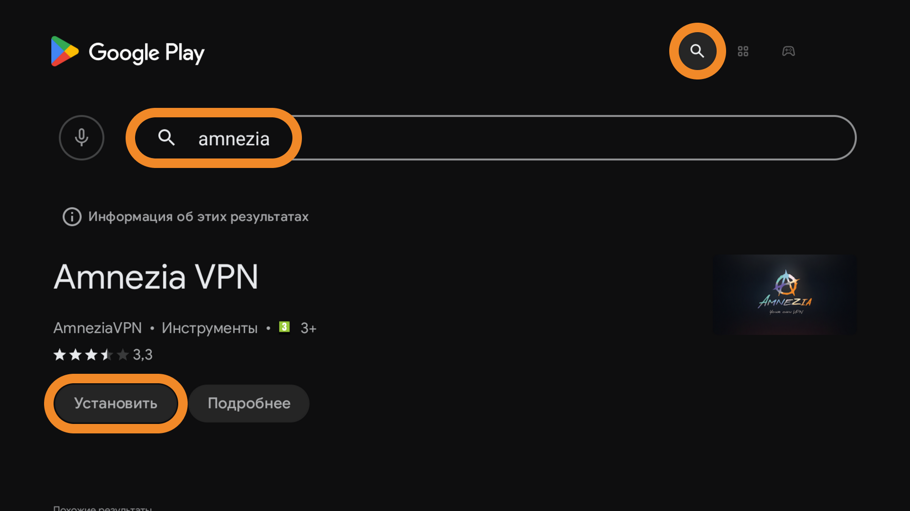
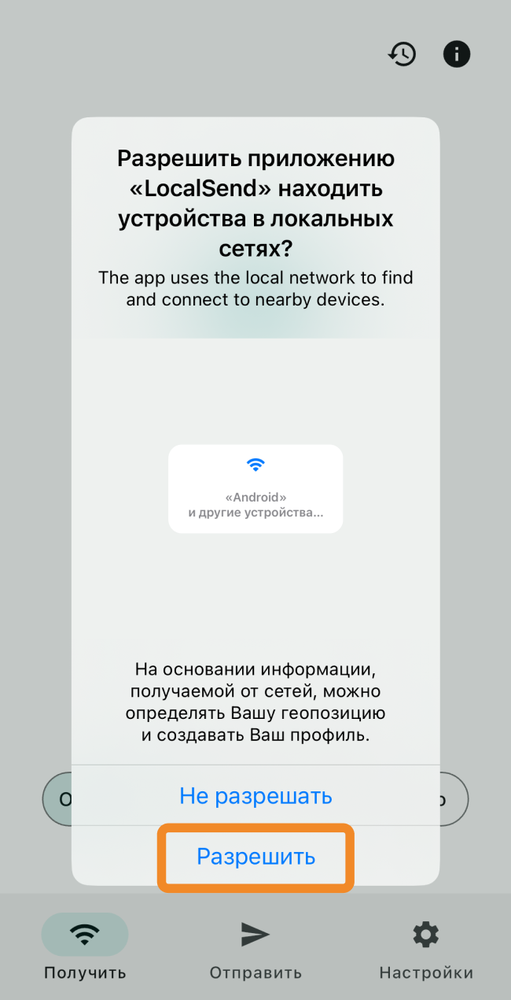

Содержание этой страницы

# Подключение AmneziaVPN на Android TV

## Общая информация[​](android_tv_connect.html#общая-информация "Прямая ссылка
на Общая информация")

В этой инструкции для пользователей **Amnezia Premium** и **Self-hosted** мы
подробно расскажем, как подключить VPN на телевизоре **Android TV** и **Google
TV** с помощью приложений **AmneziaVPN** и **LocalSend**.

Для создания VPN-подключения на телевизоре вам понадобится дополнительное
(второе) устройство, на котором будет удобно найти и скопировать ключ
подключения **vpn://** , например, смартфон, планшет, ноутбук или компьютер.

Оба устройства должны быть в **одной Wi-Fi сети и одной подсети** (одинаковый
SSID и диапазон: 2.4 или 5 ГГц). **Отключите VPN** на обоих устройствах на
время настройки.

Приложение LocalSend доступно для установки на устройства Windows, Android,
iOS, macOS и Linux.

## Шаг 1. Установка AmneziaVPN на Android
TV[​](android_tv_connect.html#шаг-1-установка-amneziavpn-на-android-tv "Прямая
ссылка на Шаг 1. Установка AmneziaVPN на Android TV")

  1. Откройте приложение **Google Play** на Android TV и перейдите в раздел поиска. В правом верхнем углу экрана нажмите значок 🔎 (**лупа**).
  2. Введите название приложения **AmneziaVPN** в поисковой строке и установите его.

* * *

## Шаг 2. Установка LocalSend на Android
TV[​](android_tv_connect.html#шаг-2-установка-localsend-на-android-tv "Прямая
ссылка на Шаг 2. Установка LocalSend на Android TV")

  1. Найдите через поиск приложение **LocalSend** и установите его.

  2. Откройте приложение **LocalSend** и нажмите кнопку **Включено** — приложение готово для получения ключа с другого устройства.

При запуске приложения вашему устройству будет присвоено случайное имя,
например, Strong Lemon #219 как на скриншоте ниже.

* * *

## Шаг 3. Установка LocalSend на втором
устройстве

В качестве второго устройства используйте то, на котором вам будет удобно
скопировать ключ подключения **vpn://**.

  1. Установите приложение **LocalSend** : https://localsend.org/ru/download

Если установочный файл не скачивается на Windows, временно отключите или
наоборот включите VPN.

  2. Откройте приложение **LocalSend**. Если система запросит разрешение на доступ к локальной сети, предоставьте его, иначе вы не сможете передать данные на Android TV.

  3. Нажмите кнопку **Отправить** , чтобы перейти в меню отправки — вы увидите в списке устройств ваш **Android TV** , которому присвоено случайное имя.

Убедитесь, что случайное имя в приложении LocalSend на Android TV
**совпадает** с именем, которое вы сейчас видите на втором устройстве в списке
доступных поблизости.

Если в списке устройств поблизости нет вашего Android TV, нажмите иконку 🔄
(**обновить**).

В зависимости от типа VPN-подключения, которое вы хотите создать на Android
TV, перейдите к нужному следующему шагу:

  * [Premium](android_tv_connect.html#%D0%B2%D0%B0%D1%80%D0%B8%D0%B0%D0%BD%D1%82-1-%D0%BF%D0%BE%D0%B4%D0%BA%D0%BB%D1%8E%D1%87%D0%B5%D0%BD%D0%B8%D0%B5-amnezia-premium)
  * [Self-hosted](android_tv_connect.html#%D0%B2%D0%B0%D1%80%D0%B8%D0%B0%D0%BD%D1%82-2-%D0%BF%D0%BE%D0%B4%D0%BA%D0%BB%D1%8E%D1%87%D0%B5%D0%BD%D0%B8%D0%B5-self-hosted)

* * *

## Шаг 4. Создание VPN-подключения на Android
TV

### Вариант 1. Подключение Amnezia
Premium

  1. Зайдите в **личный кабинет** Amnezia Premium на втором устройстве. Если вы уже авторизованы в нём, в разделе **Параметры подключения** нажмите кнопку **Копировать** возле ключа подключения — ключ скопируется в буфер обмена.

Если вы не авторизованы в личном кабинете, скопируйте ключ для передачи на
Android TV из письма, которое вы получили на почту после оплаты Premium-
подписки.

  2. Откройте приложение **LocalSend на втором устройстве** и нажмите кнопку **Текст**.
  3. Вставьте скопированный ранее ключ подключения в появившемся окне и нажмите **Подтвердить**.
  4. Выберите ваш Android TV в списке **Устройства поблизости**.

  5. Откройте приложение **LocalSend на Android TV** и нажмите кнопку **Копировать** — ключ подключения скопируется в буфер обмена.

  6. Перейдите в приложение **AmneziaVPN на Android TV** и нажмите кнопку **Let’s get started**.

  7. Нажмите **Insert** справа от поля ввода ключа, затем **Continue** → **Connect**.

У вас создалось новое подключение **Amnezia Premium** — можно подключаться.

При первом подключении в AmneziaVPN **система запросит разрешение** на
создание приложением VPN-подключений — **нажмите OK**.

Если у вас возникает проблема с переходом в раздел локаций с главного экрана
приложения, нажмите на ваше подключение **Amnezia Premium** , далее на иконку
⚙️ (**шестерёнка**) **справа** от Amnezia Premium — откроется список всех
локаций, доступных для подключения.

* * *

### Вариант 2. Подключение Self-
hosted[​](android_tv_connect.html#вариант-2-подключение-self-hosted "Прямая
ссылка на Вариант 2. Подключение Self-hosted")

  1. Откройте приложение **AmneziaVPN** на втором устройстве, перейдите в раздел **Поделиться VPN** (вторая иконка в нижней панели приложения) и нажмите кнопку **Поделиться**.
  2. Нажмите кнопку **Скопировать** — ключ подключения скопируется в буфер обмена.

  3. Откройте приложение **LocalSend на втором устройстве** и нажмите кнопку **Текст**.
  4. Вставьте скопированный ранее ключ подключения в появившемся окне и нажмите **Подтвердить**.
  5. Выберите ваш Android TV в списке **Устройства поблизости**.

  6. Откройте приложение **LocalSend на Android TV** и нажмите **Копировать** — ключ подключения скопируется в буфер обмена.

  7. Перейдите в приложение **AmneziaVPN на Android TV** и нажмите **Let’s get started**.

  8. Нажмите **Insert** справа от поля ввода ключа, затем **Continue** → **Connect**.

У вас создалось новое подключение — можно подключаться.

При первом подключении в AmneziaVPN система запросит разрешение на создание
приложением VPN-подключений — **нажмите OK**.

