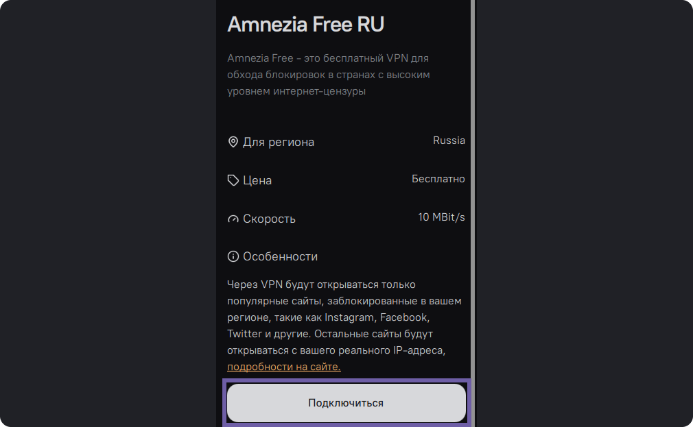
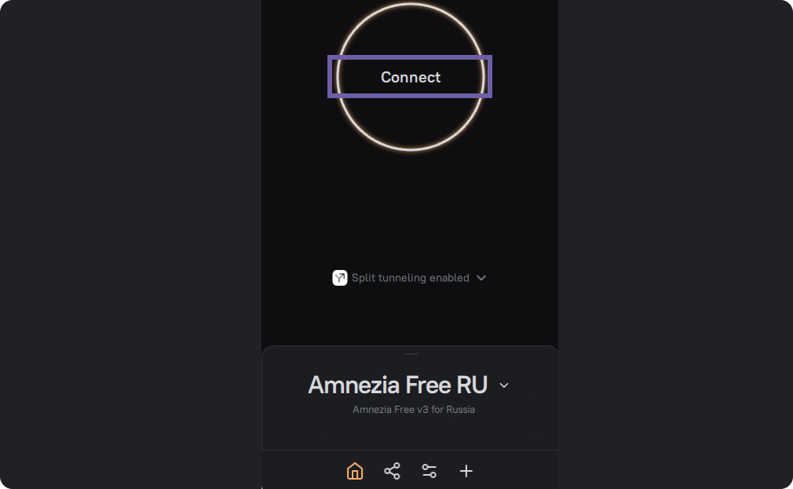
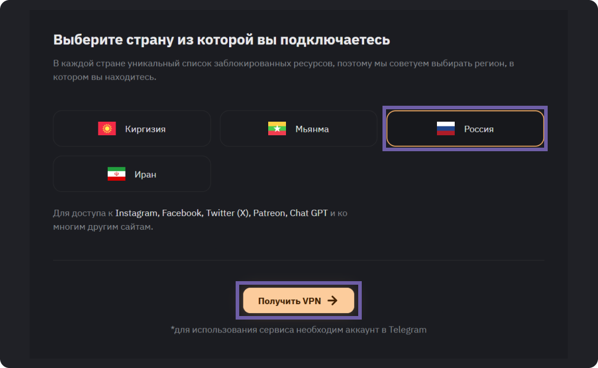
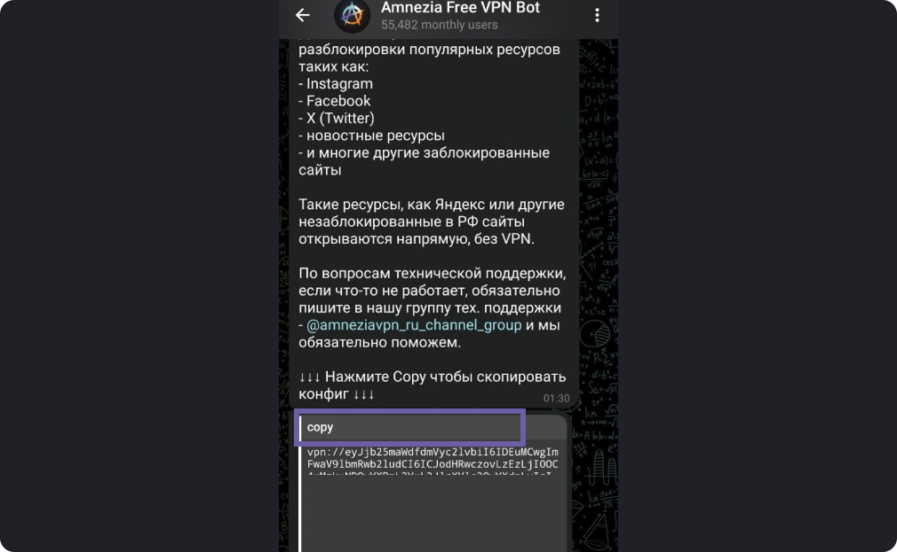

# Подключение к Amnezia Free

Amnezia Free- это бесплатный VPN-сервис дял обхода блокировок в конкретном
регионе, более подробно можно [почитать на страничке -
AmneziaFree](https://storage.googleapis.com/kldscp/amnezia.org/free).

На первом экране нажмите на кнопку "Приступим"

Далее выберите "VPN от Amnezia"

Если у вас уже включен VPN (от Amnezia или любой другой), во время первого
подключения к AmneziaFree обязательно отключитесь от него, чтобы сервис мог
выдать вам конфигурацию для вашего региона"

Выберите сервис Amnezia Free

На этом экране вы можете прочитать описание сервиса. Дажее нажмите на кнопку
"Подключиться"

На главном экране нажмите на центральную кнопку "Подключиться"

В некоторых случаях сервер может быть перегружен или не работать по разным
причинам. В таком случае попробуйте воспользоваться запросом конфигурации
через telegram-бота. Для этого зайдите на сайт https://amnezia.org/ru/free
выберите "Получить VPN".

Выберите ваш регион, далее нажмите "Получить VPN",

вы попадете в телеграм бот, нажмите "Start"

бот выдаст ключ, скопируйте его

и вставьте в первую строку на стартовом экране приложения

Нажмите "Подключиться"

Если подключиться к Amnezia Free не получается, перейдите по ссылке - [Не могу
подключиться к AmneziaFree](../../troubleshooting/amneziafree-key-not-
working.html), напишите в [нашу
группу](https://t.me/amneziavpn_ru_channel_group), или на почту
**[support@amnezia.org](mailto:support@amnezia.org)** мы поможем с решением
проблемы.