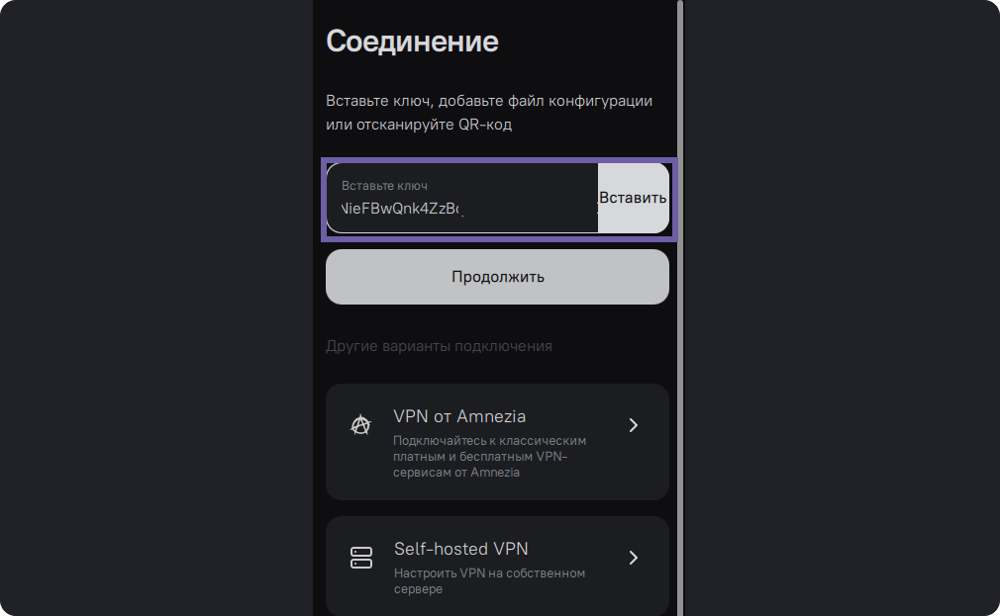
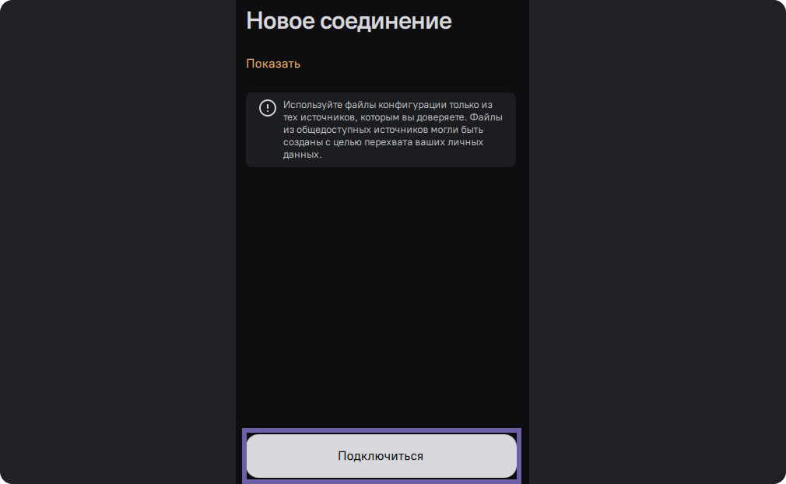

# Подключение через ключ в виде текста

Подключиться можно только к уже созданному VPN. Существует несколько способов
это сделать.

  * Сканирование QR-кода
  * Ввод в строку ключа в виде текста (конфигурации)
  * Импорт файла конфигурации в приложение

Здесь речь пойдет о подключении с помощью ключа в виде текста.

Если вам требуется создать свой VPN на собственном сервере, обратитесь к
инструкции - [установка VPN на сервер](install-vpn-on-server.html).

На первом экране нажмите на кнопку "Приступим"

Скопируйте ключ из источника и вставьте в самую первую строку. Amnezia
поддерживает ключи в форматах JSON (протоколы ShadowSocks, VLESS, VMESS,
Reality,) .conf, .ovpn, .vpn

Ключи от сервсиа [Amnezia
Free](https://storage.googleapis.com/kldscp/amnezia.org/free) можно получить
в приложении, для этого на этом экране выберите "VPN от Amnezia" далее
"Amnezia Free".

Ключи от сервиса [Amnezia
Premium](https://storage.googleapis.com/kldscp/vpnpay.io/ru/amnezia-premium)
вы получите в письме после оплаты, к каждому из них нужно по-очереди
подключится.

Ключи от других VPN-сервисов так же просто вставьте в строку.

Не используйте ключи из публичных источников, они могли быть размещены с целью
перехвата ваших личных данных.

На этом экране вы можете посмотреть содержимое ключа при нажатии на слово
"Показать". Далее кликните “Подключиться”.

Дождитесь пока Amnezia настроит ваш VPN.

Нажмите на кнопку “Подключиться”.

