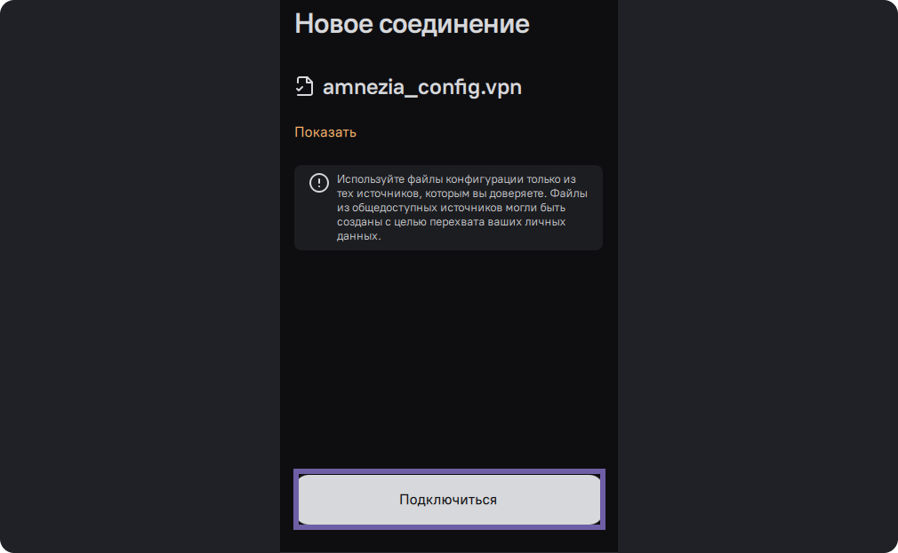

# Подключение через файл конфигурации

Подключиться можно только к уже созданному VPN. Существует несколько способов
это сделать.

  * Сканирование QR-кода
  * Ввод в строку ключа в виде текста (конфигурации)
  * Импорт файла конфигурации в приложение

Здесь речь пойдет о подключении с помощью файла.

Если вам требуется создать свой VPN, обратитесь к инструкции - [установка VPN
на сервер](install-vpn-on-server.html).

На первом экране нажмите "Приступим"

Amnezia поддерживает файлы в форматах **.json**(протоколы VLESS, VMESS,
Reality,) , **.conf** , **.ovpn** , **.vpn**

Amnezia не поддерживает файлы в формате **.json** для протокола ShadowSocks,
но поддерживает добавление ключа в этом формате.

Не используйте файлы из публичных источников, они могут быть размещены с целью
перехвата ваших личных данных.

Нажмите на “Файл с настройками подключения” и выберете файл на вашем
устройстве.

Здесь можно посмотреть содержимое файла. Далее нажмите “Подключиться”.

Дождитесь пока Amnezia настроит ваш VPN.

Нажмите на кнопку “Подключиться” на главном экране.

[Предыдущая страницаПодключение через ключ в виде текста](connect-via-text-
key.html)[Следующая страницаПодключение через QR-код](connect-via-qr-
code.html)

Обращайтесь в чат за помощью, если что-то не получается

Продукты

[Amnezia Premium](https://amnezia.org/premium)[Amnezia
Free](https://amnezia.org/free)[Amnezia Self-hosted](https://amnezia.org/self-
hosted)

Ресурсы

[Документация](../../documentation.html)[Решение
проблем](../../troubleshooting.html)[FAQ](../../faq.html)

Контакты

[Github](https://github.com/amnezia-vpn/amnezia-
client)[Telegram](https://t.me/amnezia_vpn)[Reddit](https://reddit.com/r/AmneziaVPN/)

