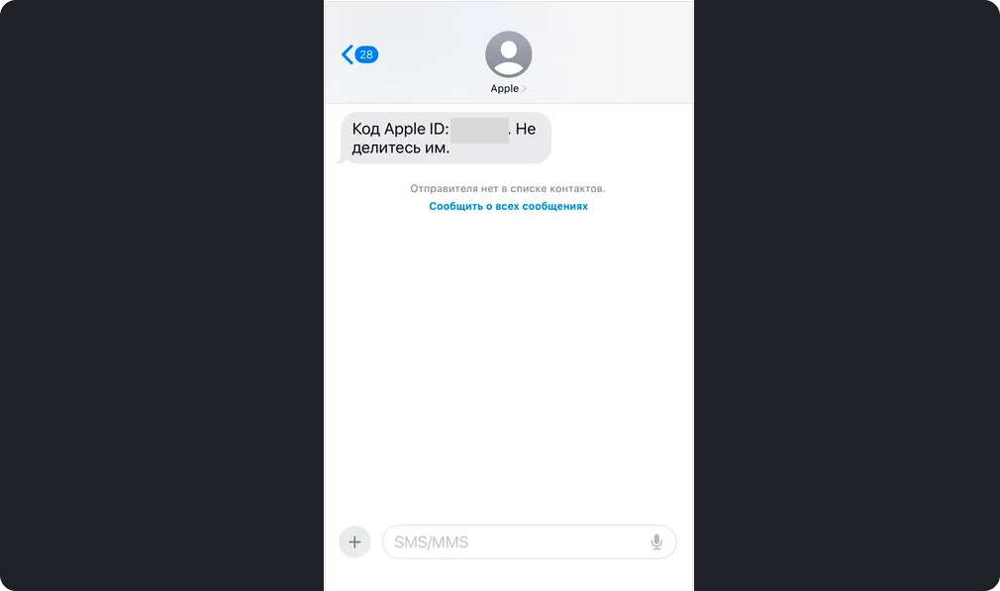

Содержание этой страницы

# Установка AmneziaVPN на iOS для жителей России

Для ключей [Amnezia Free](https://storage.googleapis.com/amnezia/jo32rv6f) и
[Amnezia Premium](https://storage.googleapis.com/amnezia/r7yhna2w) вы можете
использовать альтернативное приложение AmneziaWG, Смотрите более подробную
инструкцию [для Amnezia Free](connect-amfree.html) и [для Amnezia
Premium](first-connect-amnezia-premium.html) .

К сожалению, на территории России установка приложения AmneziaVPN из AppStore
не возможна из-за введенных региональных ограничений по требованию
Роскомнадзора.

Если вы не проживаете на территории России, вы можете напряму скачать
приложение из AppStore

Для жителей России мы рекомендуем сменить регион устройства, так как
ограничения в AppStore именно региональные. Пожалуйста ознакомьтесь со всеми
предупреждающими надписями, это способ может подойти не всем пользователям.

Если вам нужны платные приложения в AppStore и у вас нет карты того региона,
на который вы решили сменить геолокацию, Вы можете создать дополнительную
учетную запись Apple ID, и использовать ее в дополнении к основной.

### Как поменять регион единственной учетной записи ?

**Шаг 1**

Перед тем как сменить регион, нужно чтобы на счете в App Store был нулевой
баланс. Для этого откройте AppStore, Если у вас есть деньги, там отобразится
соответствующая сумма. Если вы не видите ее, у вас нет остатка на счете.

Если на счете остались средства, сменить регион не получится. Если остаток на
счету меньше стоимости какого-нибудь приложения, Apple советует обратиться с
этой проблемой к ним в поддержку.

**Шаг 2**

Так же перед сменой региона необходимо будет отменить все подписки

Для этого откройте "Настройки", нажмите на свое имя в верхней части экрана,
далее "Подписки" , появится экран с действующими и заверщенными подписками.

Нажмите «Отменить подписку». Если кнопки «Отменить» нет или отображается
сообщение об истечении срока действия с красным текстом, это означает, что
подписка уже отменена.

Теперь приступи к смене региона:

  * Откройте «Настройки».

  * Нажмите на свое имя, затем выберите «Контент и покупки» → «Просмотреть».

  * Возможно, потребуется ввести логин и пароль от Apple ID.

  * Нажмите «Страна/регион». Если у вас есть активные подписки, Apple сообщит о необходимости их отменить.

  * Нажмите «Изменить страну или регион». Выберите из списка нужную страну (советуем выбирать USA или Канаду). Помните, что некоторые сервисы Apple не работают в определенных регионах.
  * Пролистайте положения и условия. Нажмите «Принять» в верхнем правом углу.
  * Выберите способ оплаты. Он нужен для подписок и покупок. Если не планируете их совершать, выберите «Нет». Страна, в которой находится выдавший карту банк, должна совпадать с выбранным регионом. Не получится привязать к региону США карту грузинского банка.

В некоторых случаях варианта "Нет" при предложении привязать способ оплаты
может не отказаться. В таком случае выберете карту и внесите рандомные данные

  * Введите адрес для выставления счета и нажмите «Далее», если у вас нет адреса, внесите любой адрес из генератора адресов, Apple не требует подтверждения карты или телефона.

После всех действий ваш регион учетной записи изменится. Возможно, понадобится
снова авторизоваться в App Store и других сервисах.

Вы можете в любой момент сменить регион обратно на российский. Например, если
установили нужные приложения и вам больше не нужен аккаунт с американским
регионом.

### Как создать новую учетную запись?

В некоторых случая удобнее будет создать дополнительную учетную запись

Есть несколько способов. Расскажу о самом простом.

**Шаг 1**

Зарегестрируйте аккаунт

  * Откройте сайт Apple.

  * Введите имя и фамилию.

  * Выберите нужный регион, введите дату рождения.

  * Введите адрес электронной почты. Туда придет письмо с кодом подтверждения.

  * Укажите номер телефона, на него придет смс с кодом подтверждения. Можно использовать российские номера, даже если выбран другой регион.

  * Введите коды подтверждения с почты и смс.

Если все коды введены верно, Apple создаст новый аккаунт. Вы можете сразу
начать им пользоваться.

**Шаг 2**

Авторизируйтесь с новой учетной записью

  * Откройте «Настройки».

  * Нажмите на свое имя, затем выберите «Контент и покупки» → «Выйти». Это действие касается только App Store, вы все так же будете авторизованы под Apple ID на Айфоне.

  * Снова нажмите «Контент и покупки» и выберите пункт «Не Имя Фамилия». Это значит, что вы хотите авторизоваться под другим логином, отличающимся от Apple ID.

  * Введите логин и пароль.

После этого вы можете открыть App Store и скачивать приложения, доступные в
магазине вашего региона. При первой загрузке Apple попросит вас принять
положения и условия, а также выбрать адрес выставления счета и способ оплаты.
Об этом я рассказывал выше.

*На скриншоте пользователь авторизован на Айфоне под одной учетной записью AppleID, а в App Store под другой.

Если все получилось, в Appstore у вас появится AmneziaVPN.

### Скачайте AmneziaVPN из
[AppStore](https://apps.apple.com/us/app/amneziavpn/id1600529900)

Перед скачиванием AmneziaVPN убедитесь, что удалили установленную ранее
версию. В противном случае при установке возникнет ошибка.

Теперь вы сможете получить один из наших VPN-сервсиов Amnezia Premium или
Amnezia Free, а также создать VPN на собственном сервере.