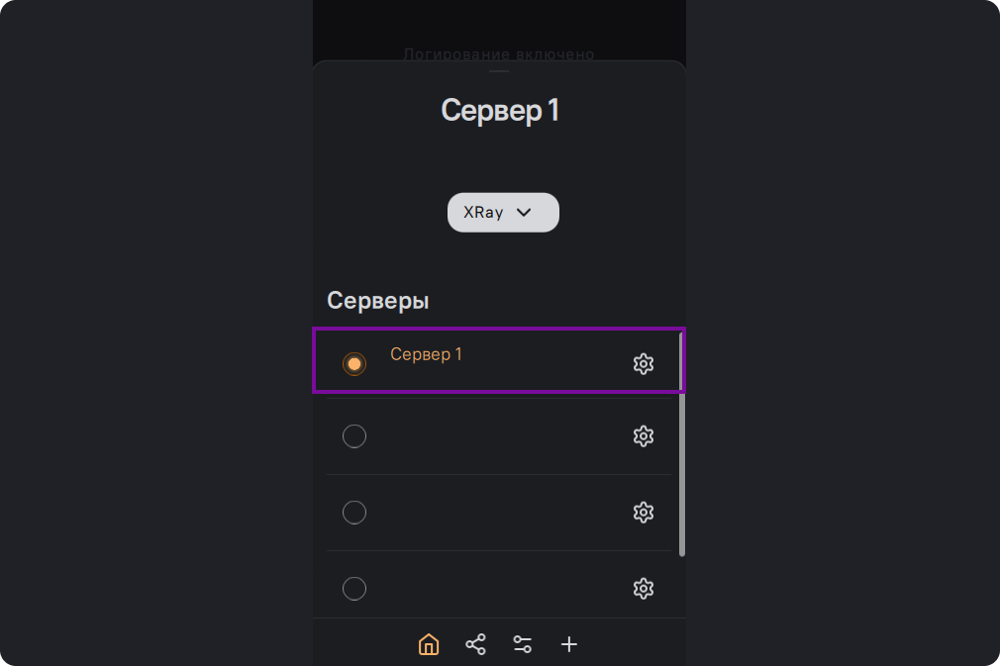

Содержание этой страницы

# Установка и настройка SOCKS5 прокси сервера

### Для чего может потребоваться установка SOCKS5?

SOCKS5 – это интернет-протокол, он умеет обрабатывать любой трафик, который
используется для передачи пакетов с данными от сервера к клиенту с помощью
промежуточного прокси-сервера. При ее использовании трафик проходит через
прокси-сервер, который использует собственный IP-адрес, с которого уже идет
финальное подключение к нужному адресату.

Нажмите на название сервера на главном экране

Нажмите на значок настроек возле названия севера

Во вкладке сервисы выберите SOCKS5 прокси-сервер.

На следующем экране можно выбрать порт или оставить его по-умолчанию (позднее
его можно будет сменить в настройках). Далее нажмите на кнопку "Установить"

После установки можно поменять настройки SOCKS5. Для этого снова выберите
"Прокси-сервер SOCKS5".

Далее "Прокси-сервер SOCKS5".

В этом окне можно посмотреть порт, хост, имя пользователя и пароль.

